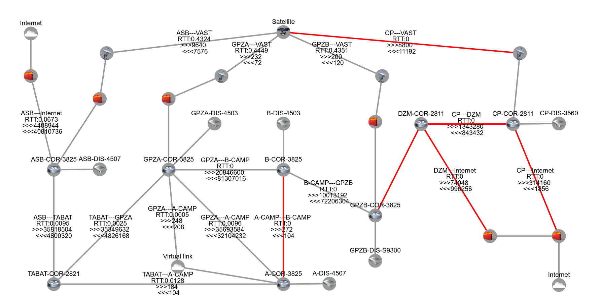

zabbix-aggregator
=======================

特性:

+ item项搜索及数据汇总
+ trigger项搜索及数据汇总
+ 基于[cytoscape](http://js.cytoscape.org/)的sysmap系统拓扑图展现




### Usage

1. configuration

    modify value in config/default.json to match db configuration

    ```
        "mysql": {
          "host": "localhost",
          "port": 3306,
          "user": "root",
          "password": "root",
          "database": "zabbix"
        },

        "redis": {
          "host": "localhost",
          "port": 6379
        }
    ```

2. start server

```
node app.js
```

3. running postman test cases

```
npm run test
```

### License

MIT

